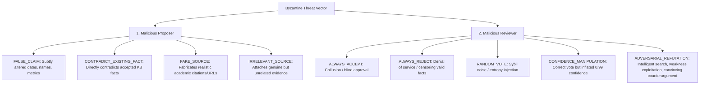
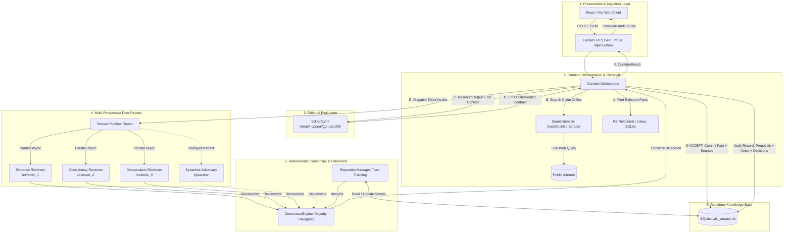
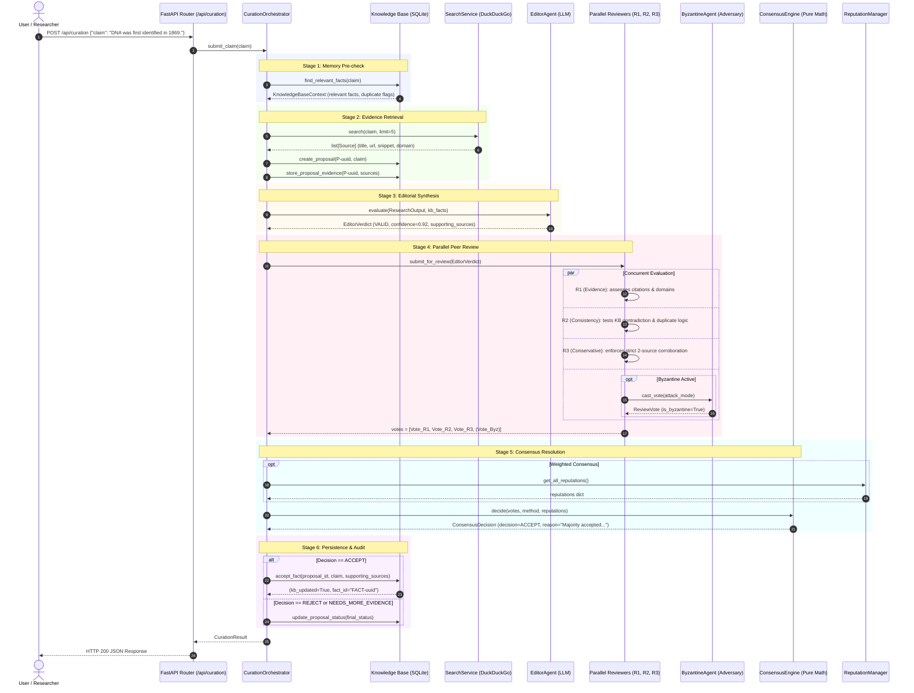
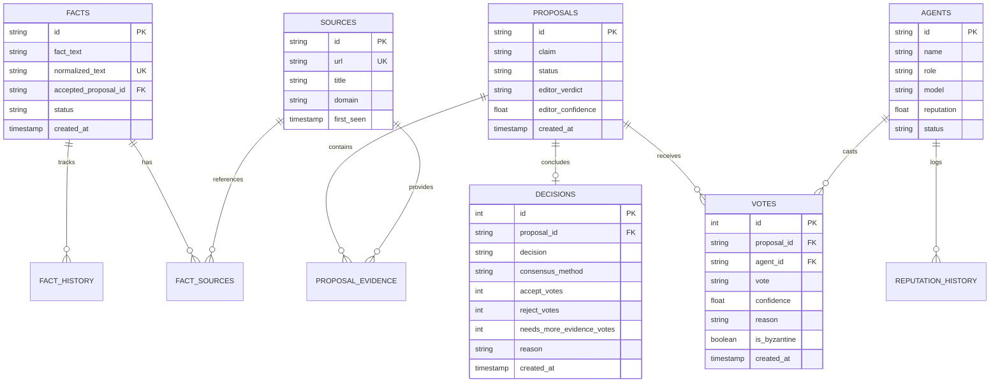

# Wiki Curator: Decentralized Multi-Agent Knowledge Curation with Byzantine Fault Tolerance
**Academic Case Study & Comprehensive System Architecture**  
**Course Context:** Foundations of Artificial Intelligence (FoAI) — Semester 7 Final Project  

---

## Table of Contents
1. [Executive Summary](#1-executive-summary)
2. [Problem Statement](#2-problem-statement)
   - [The Epistemic Limitations of Single-Agent LLMs](#21-the-epistemic-limitations-of-single-agent-llms)
   - [The Peril of Knowledge Base Contamination](#22-the-peril-of-knowledge-base-contamination)
   - [Byzantine Faults in Autonomous Multi-Agent Environments](#23-byzantine-faults-in-autonomous-multi-agent-environments)
   - [Core Project Objectives](#24-core-project-objectives)
3. [Case Study Formulation](#3-case-study-formulation)
   - [Hypothesis & Research Questions](#31-hypothesis--research-questions)
   - [Curated Benchmark Dataset (60 Ground-Truth Claims)](#32-curated-benchmark-dataset-60-ground-truth-claims)
   - [Adversarial Threat Model](#33-adversarial-threat-model)
   - [Evaluation Metrics](#34-evaluation-metrics)
4. [System Architecture & Multi-Agent Dataflow](#4-system-architecture--multi-agent-dataflow)
   - [End-to-End Architectural Diagram](#41-end-to-end-architectural-diagram)
   - [Sequential Dataflow Diagram](#42-sequential-dataflow-diagram)
   - [Shared Pydantic v2 Communication Contracts](#43-shared-pydantic-v2-communication-contracts)
5. [In-Depth Working and Purpose of All Models & Agents](#5-in-depth-working-and-purpose-of-all-models--agents)
   - [5.1 Research Agent (Algorithmic Retrieval)](#51-research-agent-algorithmic-retrieval)
   - [5.2 Editor Agent (Editorial Synthesis & Filtering)](#52-editor-agent-editorial-synthesis--filtering)
   - [5.3 Evidence Reviewer (Empirical Verification & Source Authority)](#53-evidence-reviewer-reviewer_1)
   - [5.4 Consistency Reviewer (Logical Coherence & KB Memory Cross-Reference)](#54-consistency-reviewer-reviewer_2)
   - [5.5 Conservative Reviewer (Strict Skeptical Baseline)](#55-conservative-reviewer-reviewer_3)
   - [5.6 Byzantine Adversary Agent (Adaptive Attack Simulation)](#56-byzantine-adversary-agent-byzantine)
   - [5.7 Consensus Engine (Deterministic Vote Aggregation)](#57-consensus-engine-deterministic-aggregation)
   - [5.8 Reputation Manager (Dynamic Trust Calibration)](#58-reputation-manager-dynamic-trust-calibration)
6. [Consensus Algorithms & Mathematical Foundations](#6-consensus-algorithms--mathematical-foundations)
   - [Simple Majority Voting](#61-simple-majority-voting)
   - [Reputation-Weighted Voting](#62-reputation-weighted-voting)
   - [Dynamic Reputation Update Rules](#63-dynamic-reputation-update-rules)
7. [Database Schema & Persistence Layer](#7-database-schema--persistence-layer)
   - [Knowledge Base Relational Model](#71-knowledge-base-relational-model)
   - [Review, Vote, and Audit Trail Model](#72-review-vote-and-audit-trail-model)
   - [Normalization and Deduplication Strategy](#73-normalization-and-deduplication-strategy)
8. [API Endpoints & Integration Surface](#8-api-endpoints--integration-surface)
9. [Experimental Observations & Case Study Findings](#9-experimental-observations--case-study-findings)
10. [Conclusion & Future Work](#10-conclusion--future-work)

---

## 1. Executive Summary

Modern AI systems increasingly rely on shared, structured knowledge bases (KBs) to ground generation, retrieve facts (RAG), and enforce reasoning integrity. However, relying on a single Large Language Model (LLM) or unverified automated pipelines to curate factual data introduces fatal single-point-of-failure vulnerabilities: hallucinations, sycophancy, out-of-date parametric memory, and susceptibility to poisoned prompts.

**Wiki Curator** addresses this foundational AI challenge by implementing a **decentralized, multi-agent, multi-perspective factual verification and knowledge base curation pipeline** endowed with **Byzantine Fault Tolerance (BFT)**. Rather than relying on a single model's unilateral assertion, incoming claims pass through a multi-stage assembly:
1. Real-world external web information retrieval (**Research Agent**),
2. Contextual evaluation against existing memory (**Editor Agent**),
3. Parallel, multi-perspective peer review by specialized LLM agents (**Evidence**, **Consistency**, and **Conservative Reviewers**),
4. Stress-testing against an adaptive adversarial model (**Byzantine Agent**),
5. Deterministic, non-hallucinating aggregation (**Consensus Engine**) weighted by historical reliability (**Reputation System**).

Accepted claims are permanently persisted with full provenance into a structured SQLite knowledge base.

---

## 2. Problem Statement

### 2.1 The Epistemic Limitations of Single-Agent LLMs
While modern LLMs demonstrate remarkable linguistic fluency, their epistemic guarantees are fundamentally weak:
* **Hallucination & Fabrication:** Under zero-shot or few-shot prompts, models readily fabricate citations, historical dates, and scientific assertions with high statistical confidence.
* **Sycophancy & Prior Bias:** Models are vulnerable to leading prompts, agreeing with false presuppositions embedded in user queries.
* **Lack of Self-Correction:** When queried recursively, a single model tends to reinforce and rationalize its previous hallucinations rather than spot its own logical inconsistencies.

### 2.2 The Peril of Knowledge Base Contamination
In automated knowledge curation, accepting a single false proposition into long-term storage causes **cascading epistemic corruption**:
* Downstream retrieval-augmented generation (RAG) pipelines ingest the hallucinated fact as verified ground truth.
* Subsequent submissions that logically depend on the false premise are accepted, compounding error drift over time.
* Deletion and contradiction resolution in unstructured stores are notoriously expensive.

### 2.3 Byzantine Faults in Autonomous Multi-Agent Environments
When multiple agents collaborate in open or semi-open distributed environments, failures are rarely just random noise. They can be **Byzantine**:
* **Malicious Proposers:** Proposers deliberately inject subtle untruths (e.g. changing an inventor's name or a critical timestamp while keeping the surrounding text identical) or fabricate realistic-looking URLs.
* **Dishonest Reviewers:** Compromised nodes may vote systematically to accept falsehoods (`ALWAYS_ACCEPT`), reject legitimate scientific consensus (`ALWAYS_REJECT`), inject chaos (`RANDOM_VOTE`), or manipulate vote weights via artificial certainty (`CONFIDENCE_MANIPULATION`).
* **Intelligent Adversaries:** The most dangerous threat is an intelligent adversary that inspects real-world search evidence, identifies linguistic ambiguities or minor conflicting sources, and constructs a grounded, persuasive counterargument to sway consensus away from the truth (`ADVERSARIAL_REFUTATION`).

### 2.4 Core Project Objectives
1. **Separation of Concerns:** Separate data acquisition, editorial synthesis, critical peer review, and decision aggregation across specialized agents.
2. **Cognitive & Model Diversity:** Enforce distinct reviewer personas with conflicting evaluation objectives to eliminate collective blindspots.
3. **Deterministic Finality:** Strip the final decision authority from generative models; use deterministic mathematical consensus over peer votes.
4. **Adaptive Fault Tolerance:** Dynamically track and discount compromised or unreliable agents using an automated reputation mechanism.
5. **End-to-End Provenance:** Guarantee that no fact enters the knowledge base without an unbroken chain of external sources, reviewer votes, and logged rationale.

---

## 3. Case Study Formulation

### 3.1 Hypothesis & Research Questions
* **Hypothesis 1:** A multi-perspective review panel with a dedicated conservative skeptic will reduce the False Acceptance Rate (FAR) of plausible misinformation to near zero compared to a single-agent editor.
* **Hypothesis 2:** Reputation-weighted consensus will sustain high curation accuracy even when $\ge 25\%$ of voting nodes exhibit active Byzantine behaviors.
* **Hypothesis 3:** Intelligent adversaries exploiting semantic ambiguity (`ADVERSARIAL_REFUTATION`) pose a significantly higher threat than naive adversaries (`ALWAYS_ACCEPT` or `RANDOM_VOTE`), requiring explicit literal-claim decomposition rules.

### 3.2 Curated Benchmark Dataset (60 Ground-Truth Claims)
To evaluate the system empirically, a balanced dataset of 60 claims was constructed across five knowledge domains (Science, Technology, Geography, History, Culture):
* **30 True Claims (Verifiable Ground Truth):**
  * *Science:* "The human body has 206 bones in adulthood", "Water boils at 100 degrees Celsius at sea level", "Oxygen makes up about 21% of Earth's atmosphere".
  * *Technology:* "Python was created by Guido van Rossum", "Linux was created by Linus Torvalds in 1991", "The first iPhone was released in 2007".
  * *History:* "The Eiffel Tower was completed in 1889", "The Berlin Wall fell in November 1989", "The Titanic sank in April 1912".
  * *Geography:* "The Amazon River is the largest river by discharge volume", "Australia is both a country and a continent".
* **30 False Claims (Plausible, Subtly Perturbed Misinformation):**
  * *Science:* "The human body has 305 bones in adulthood" (perturbed number), "Water boils at 90 degrees Celsius at sea level" (perturbed metric), "Oxygen makes up about 78% of Earth's atmosphere" (substituted nitrogen percentage).
  * *Technology:* "Python was created by James Gosling" (substituted Java creator), "Linux was created by Richard Stallman in 1985" (substituted GNU founder and earlier year), "The first iPhone was released in 2005".
  * *History:* "The Eiffel Tower was completed in 1920", "The French Revolution began in 1812".
  * *Geography:* "Beijing is the capital of Japan", "The Nile River is the largest river by discharge volume".

### 3.3 Adversarial Threat Model
The system is evaluated against an adversarial agent capable of operating across two vectors:



### 3.4 Evaluation Metrics
Experiments conducted via the [ExperimentRunner](file:///c:/Users/eshwar/Documents/CLG/SEM-7/FoAI/FInal%20Project/wiki_curator/wiki-curator/backend/experiments/runner.py) compute the following quantitative indicators:
1. **Classification Accuracy ($\text{Acc}$):** Fraction of proposals where consensus matches ground truth:
   $$\text{Acc} = \frac{TP + TN}{TP + TN + FP + FN}$$
2. **False Acceptance Rate ($\text{FAR}$):** Rate at which false claims bypass review and are marked `ACCEPT`:
   $$\text{FAR} = \frac{FP}{FP + TN}$$
   *(The most critical metric for KB integrity; must remain as close to $0.0$ as possible).*
3. **False Rejection Rate ($\text{FRR}$):** Rate at which true claims are erroneously marked `REJECT` or `NEEDS_MORE_EVIDENCE`:
   $$\text{FRR} = \frac{FN}{TP + FN}$$
4. **Consensus Rate:** Proportion of proposals achieving a decisive verdict (`ACCEPT` or `REJECT`) without deadlocking on `NEEDS_MORE_EVIDENCE`.
5. **Reviewer Agreement:** Pairwise inter-agent concordance across honest reviewers.
6. **Byzantine Success Rate:** Percentage of proposals where the Byzantine agent's preferred adversarial outcome successfully determined the final consensus decision.
7. **Average Latency:** Wall-clock response latency per claim submission in milliseconds.

---

## 4. System Architecture & Multi-Agent Dataflow

### 4.1 End-to-End Architectural Diagram



---

### 4.2 Sequential Dataflow Diagram

The lifecycle of a single claim from user submission to permanent persistence follows an eight-stage sequence:



---

### 4.3 Shared Pydantic v2 Communication Contracts

All subsystem communication boundaries are strictly enforced via strongly-typed schemas defined in [messages.py](file:///c:/Users/eshwar/Documents/CLG/SEM-7/FoAI/FInal%20Project/wiki_curator/wiki-curator/backend/schemas/messages.py):

* **[Source](file:///c:/Users/eshwar/Documents/CLG/SEM-7/FoAI/FInal%20Project/wiki_curator/wiki-curator/backend/schemas/messages.py#L75-L81):** A discrete piece of external evidence (`title`, `url`, `snippet`, `domain`).
* **[ResearchOutput](file:///c:/Users/eshwar/Documents/CLG/SEM-7/FoAI/FInal%20Project/wiki_curator/wiki-curator/backend/schemas/messages.py#L83-L89):** Container passing the proposal ID, original claim, and all retrieved `Source` objects.
* **[EditorVerdict](file:///c:/Users/eshwar/Documents/CLG/SEM-7/FoAI/FInal%20Project/wiki_curator/wiki-curator/backend/schemas/messages.py#L93-L119):** Primary boundary hand-off. Contains `verdict` (`VALID`, `CONTRADICTED`, `INSUFFICIENT_EVIDENCE`), `confidence` ($0.0-1.0$), `supporting_sources`, `all_sources` (unfiltered research preserved to grant peer reviewers independent scope), `conflicts`, and `existing_kb_facts`.
* **[ReviewVote](file:///c:/Users/eshwar/Documents/CLG/SEM-7/FoAI/FInal%20Project/wiki_curator/wiki-curator/backend/schemas/messages.py#L123-L133):** Individual reviewer verdict (`ACCEPT`, `REJECT`, `NEEDS_MORE_EVIDENCE`), numerical `confidence`, traceable `reason`, and boolean flag `is_byzantine`.
* **[ConsensusDecision](file:///c:/Users/eshwar/Documents/CLG/SEM-7/FoAI/FInal%20Project/wiki_curator/wiki-curator/backend/schemas/messages.py#L136-L148):** Deterministic output recording vote tallies, algorithm used, resolution rationale, and nested vote details.
* **[CurationResult](file:///c:/Users/eshwar/Documents/CLG/SEM-7/FoAI/FInal%20Project/wiki_curator/wiki-curator/backend/schemas/curation.py#L19-L28):** Unified payload returned to clients, encapsulating the entire lifecycle trace.

---

## 5. In-Depth Working and Purpose of All Models & Agents

### 5.1 Research Agent (Algorithmic Retrieval)
* **Underlying Engine:** Pure Python (`httpx` async client + DuckDuckGo HTML scraping adapter in [search.py](file:///c:/Users/eshwar/Documents/CLG/SEM-7/FoAI/FInal%20Project/wiki_curator/wiki-curator/backend/services/search.py)).
* **Purpose:** Acts as the uncorrupted epistemic window to the outside world. **Deliberately does not use an LLM** to prevent pre-retrieval hallucinations or fabricated citations.
* **Working Mechanics:**
  1. Receives the raw text of the claim.
  2. Queries DuckDuckGo HTML endpoint using custom User-Agent headers with URL unquoting and link extraction.
  3. Strips HTML tags, parses result titles and snippets, and extracts network domains (e.g. `wikipedia.org`, `nature.com`).
  4. Deduplicates URLs and returns up to $k$ (`max_results = 5`) structured `Source` objects. If internet connectivity fails, returns an empty list gracefully, triggering downstream `INSUFFICIENT_EVIDENCE` fallback.

---

### 5.2 Editor Agent (Editorial Synthesis & Filtering)
* **Model Slot:** `models.editor` (e.g., `openai/gpt-oss-20b` or Groq-hosted Llama-3/Grok).
* **Implementation:** [editor_agent.py](file:///c:/Users/eshwar/Documents/CLG/SEM-7/FoAI/FInal%20Project/wiki_curator/wiki-curator/backend/agents/editor_agent.py).
* **Purpose:** Serves as the primary synthesis filter. Instead of allowing downstream reviewers to evaluate raw unstructured web dumps, the Editor organizes sources, extracts supporting citations, detects explicit contradictions, and assigns an initial probability distribution.
* **System Prompt Core Directive:**
  > *"Evaluate only the supplied claim, research sources, and accepted knowledge-base facts. Do not invent sources, citations, facts, or conflicts. Return JSON with verdict (VALID, CONTRADICTED, or INSUFFICIENT_EVIDENCE), confidence (0..1), supporting_source_indexes, conflicts, and reason."*
* **Working Mechanics:**
  1. Inspects raw sources; if zero sources exist, immediately returns `INSUFFICIENT_EVIDENCE` with $0.0$ confidence without consuming LLM tokens.
  2. Submits a structured prompt containing the claim, retrieved sources (indexed $0$ to $n-1$), and existing KB facts.
  3. Parses the structured JSON output into an `EditorVerdict`. Crucially, it copies `all_sources` into the verdict alongside `supporting_sources`. This ensures that even if the Editor mistakenly filters out relevant evidence, downstream reviewers retain access to the complete context.

---

### 5.3 Evidence Reviewer (`reviewer_1`)
* **Model Slot:** `models.reviewer_1` (configured in `config.yaml`).
* **Implementation:** [evidence_reviewer.py](file:///c:/Users/eshwar/Documents/CLG/SEM-7/FoAI/FInal%20Project/wiki_curator/wiki-curator/backend/agents/evidence_reviewer.py).
* **Role & Specialization:** **Empirical Support & Source Credibility Specialist.**
* **Core Directives:**
  * **Literal Claim First:** Must interpret the claim verbatim. Prohibits reinterpreting terms into convenient alternative meanings.
  * **Citation Quality Hierarchy:** Favors peer-reviewed research, governmental, university, and established reference works; penalizes blogs, commercial SEO content, and forums.
  * **Direct Support vs. Topical Overlap:** Strictly verifies whether a source supports the *exact specific assertion* rather than merely sharing keywords with the topic.
  * **Compound Claim Decomposition:** If a claim asserts multiple components ($A \land B$), the reviewer verifies that sources independently validate both $A$ and $B$.
* **Output:** [ReviewVote](file:///c:/Users/eshwar/Documents/CLG/SEM-7/FoAI/FInal%20Project/wiki_curator/wiki-curator/backend/schemas/messages.py#L123-L133) with structured reasoning tracing: `CLAIM PROPOSITION -> SOURCE -> WHAT IT SAYS -> HOW IT RELATES -> CONCLUSION`.

---

### 5.4 Consistency Reviewer (`reviewer_2`)
* **Model Slot:** `models.reviewer_2` (configured in `config.yaml`).
* **Implementation:** [consistency_reviewer.py](file:///c:/Users/eshwar/Documents/CLG/SEM-7/FoAI/FInal%20Project/wiki_curator/wiki-curator/backend/agents/consistency_reviewer.py).
* **Role & Specialization:** **Memory Integrity, Logical Coherence & Conflict Detection.**
* **Core Directives:**
  * **Mandatory KB Comparison:** Systematically compares the candidate claim against every existing KB fact provided in context, explicitly classifying each as `SUPPORTS`, `CONTRADICTS`, `UNRELATED`, or `INSUFFICIENT`.
  * **Duplicate Detection:** Identifies semantic duplicates of already accepted facts. If a claim duplicates existing knowledge under different wording, it votes `NEEDS_MORE_EVIDENCE` to prompt clarification rather than polluting the KB with redundant entries.
  * **Temporal and Logical Consistency:** Evaluates internal causal coherence (e.g. verifying that event sequences, lifespans, and geographical bounds are physically and logically possible).

---

### 5.5 Conservative Reviewer (`reviewer_3`)
* **Model Slot:** `models.reviewer_3` (configured in `config.yaml`).
* **Implementation:** [conservative_reviewer.py](file:///c:/Users/eshwar/Documents/CLG/SEM-7/FoAI/FInal%20Project/wiki_curator/wiki-curator/backend/agents/conservative_reviewer.py).
* **Role & Specialization:** **The Strict Skeptic (High Evidentiary Bar).**
* **Core Directives:**
  * **Plausibility is NOT Evidence:** Explicitly forbidden from voting `ACCEPT` on the basis that a claim "sounds reasonable" or is "general knowledge." Acceptance strictly requires direct external proof.
  * **Multi-Source Corroboration:** Requires a minimum of **two independent, high-authority sources** directly confirming the proposition.
  * **Aggressive Rejection:** While naive reviewers default to `NEEDS_MORE_EVIDENCE` when faced with conflicting signals, the Conservative Reviewer converts verified contradictions into decisive `REJECT` votes to protect the KB perimeter.

---

### 5.6 Byzantine Adversary Agent (`byzantine`)
* **Model Slot:** `models.byzantine` (configured in `config.yaml`).
* **Implementation:** [byzantine_agent.py](file:///c:/Users/eshwar/Documents/CLG/SEM-7/FoAI/FInal%20Project/wiki_curator/wiki-curator/backend/agents/byzantine_agent.py).
* **Purpose:** Simulates intelligent or corrupt behaviors to stress-test the consensus boundary.
* **Key Attack Modes:**
  1. `ADVERSARIAL_REFUTATION` *(Flagship Intelligent Attack):*
     * Conducts an independent web search to identify what the evidence actually supports (the likely truth).
     * Analyzes the evidence to isolate subtle weaknesses, linguistic ambiguities, or minority counter-examples.
     * Generates a coherent, authoritative-sounding counterargument and casts an opposing vote with high confidence ($0.60 - 0.95$).
  2. `FALSE_CLAIM` / `CONTRADICT_EXISTING_FACT`: Injects plausible falsehoods into proposals.
  3. `FAKE_SOURCE` / `IRRELEVANT_SOURCE`: Fabricates academic metadata or attaches distraction snippets.
  4. `ALWAYS_ACCEPT` / `ALWAYS_REJECT` / `RANDOM_VOTE` / `CONFIDENCE_MANIPULATION`: Simulates compromised voter nodes attempting to hijack consensus.

---

### 5.7 Consensus Engine (Deterministic Aggregation)
* **Underlying Engine:** Pure Python arithmetic and boolean decision trees in [engine.py](file:///c:/Users/eshwar/Documents/CLG/SEM-7/FoAI/FInal%20Project/wiki_curator/wiki-curator/backend/consensus/engine.py).
* **Purpose:** **Completely eliminates generative LLMs from the final decision step.** Guarantees that vote counting is transparent, deterministic, reproducible, and mathematically provable.
* **Working Mechanics:** Accepts the array of `ReviewVote` objects, counts/weights the votes according to configured consensus strategies, handles tie-breaking via configuration defaults, and emits an immutable `ConsensusDecision`.

---

### 5.8 Reputation Manager (Dynamic Trust Calibration)
* **Underlying Engine:** Async SQLite ledger in [reputation.py](file:///c:/Users/eshwar/Documents/CLG/SEM-7/FoAI/FInal%20Project/wiki_curator/wiki-curator/backend/consensus/reputation.py).
* **Purpose:** Mitigates Sybil and Byzantine attacks over time by continuously tuning the voting power of each agent based on empirical performance.
* **Working Mechanics:** Maintains trust scores $R \in [0.0, 1.0]$. When ground truth is established (e.g. during controlled experiment batches or oracle reviews), scores are updated dynamically and logged in an immutable audit ledger (`reputation_history`).

---

## 6. Consensus Algorithms & Mathematical Foundations

### 6.1 Simple Majority Voting
Under simple majority, each agent $i \in \{1, \dots, N\}$ casts a discrete vote $v_i \in \{\text{ACCEPT}, \text{REJECT}, \text{NEEDS\_MORE\_EVIDENCE}\}$. The tally for each outcome $C$ is:
$$\text{Count}(C) = \sum_{i=1}^N \mathbb{I}(v_i = C)$$

The decision rule is:
$$\text{Decision} = \begin{cases} 
\text{ACCEPT} & \text{if } \text{Count}(\text{ACCEPT}) > \max(\text{Count}(\text{REJECT}), \text{Count}(\text{NME})) \\ 
\text{REJECT} & \text{if } \text{Count}(\text{REJECT}) > \max(\text{Count}(\text{ACCEPT}), \text{Count}(\text{NME})) \\ 
\text{NEEDS\_MORE\_EVIDENCE} & \text{if } \text{Count}(\text{NME}) > \max(\text{Count}(\text{ACCEPT}), \text{Count}(\text{REJECT})) \\ 
\text{TieBreak}(\text{config}) & \text{on tie conditions (default: NEEDS\_MORE\_EVIDENCE)} 
\end{cases}$$

---

### 6.2 Reputation-Weighted Voting
In weighted mode, every vote $v_i$ is scaled by the reviewer's current reputation score $R_i \in [0.0, 1.0]$ and their self-reported confidence $c_i \in [0.0, 1.0]$:
$$W(C) = \sum_{i \in \text{Voters}(C)} R_i \cdot c_i$$

The winning decision is:
$$\text{Decision}^* = \arg\max_{C \in \{\text{ACCEPT}, \text{REJECT}, \text{NME}\}} W(C)$$

If a tie occurs:
$$\text{Decision}^* = \text{settings.consensus.tie\_break}$$

*Mathematical Significance:* A Byzantine agent voting with maximum confidence ($c_{\text{byz}} = 1.0$) but low reputation ($R_{\text{byz}} = 0.1$) contributes only $0.1$ to the adversarial tally. Conversely, a reputable conservative reviewer ($R = 0.95$) voting with moderate confidence ($c = 0.8$) contributes $0.76$, neutralizing the attack even in small voting panels.

---

### 6.3 Dynamic Reputation Update Rules
Following an evaluation with verified ground truth $G \in \{\text{ACCEPT}, \text{REJECT}\}$:
$$R_i^{(t+1)} = \text{clamp}\left( R_i^{(t)} + \Delta_i, \, R_{\min}, \, R_{\max} \right)$$
where $R_{\min} = 0.0$ and $R_{\max} = 1.0$, and the delta $\Delta_i$ is determined by:
$$\Delta_i = \begin{cases}
\delta_{\text{byz}} = -0.50 & \text{if Byzantine malicious action is formally flagged} \\
\delta_{\text{correct}} = +0.20 & \text{if } v_i = G \\
\delta_{\text{incorrect}} = -0.30 & \text{if } v_i \neq G
\end{cases}$$

*(Values normalized to unit interval $[0.0, 1.0]$ based on configuration deltas).*

---

## 7. Database Schema & Persistence Layer

The persistence architecture ([db.py](file:///c:/Users/eshwar/Documents/CLG/SEM-7/FoAI/FInal%20Project/wiki_curator/wiki-curator/backend/database/db.py), [models.py](file:///c:/Users/eshwar/Documents/CLG/SEM-7/FoAI/FInal%20Project/wiki_curator/wiki-curator/backend/database/models.py), [kb_models.py](file:///c:/Users/eshwar/Documents/CLG/SEM-7/FoAI/FInal%20Project/wiki_curator/wiki-curator/backend/database/kb_models.py)) is divided into two distinct SQLite sub-domains:



### 7.3 Normalization and Deduplication Strategy
To prevent duplicate and conflicting claims, [kb_models.py](file:///c:/Users/eshwar/Documents/CLG/SEM-7/FoAI/FInal%20Project/wiki_curator/wiki-curator/backend/database/kb_models.py#L13-L15) implements `normalize_fact()`:
```python
def normalize_fact(value: str) -> str:
    return re.sub(r"\s+", " ", value.strip().casefold()).rstrip(".")
```
Before storing, the system executes an index lookup on `normalized_text`. If an identical fact exists, it updates `fact_history` with an action of `DUPLICATE_ACCEPT` while linking the new proposal and citations, preventing redundant fragmentation.

---

## 8. API Endpoints & Integration Surface

The backend exposes a clean REST API documented via OpenAPI / Swagger:

| Method | Endpoint | Description | Request / Response Payload |
| :--- | :--- | :--- | :--- |
| `POST` | `/api/curation` | **Full Pipeline Execution:** Ingestion $\to$ Web Search $\to$ Editor $\to$ Parallel Review $\to$ Consensus $\to$ KB Commit. | `ClaimSubmission` $\to$ `CurationResult` |
| `POST` | `/api/review` | **Direct Review Boundary:** Submits pre-computed `EditorVerdict` directly to reviewer panel. | `EditorVerdict` $\to$ `ProposalDetail` |
| `GET` | `/api/proposals` | Paginated listing of proposals, verdicts, and statuses. | Query params $\to$ `list[ProposalDetail]` |
| `GET` | `/api/proposals/{id}` | Full detail of a specific proposal including all votes. | Path param $\to$ `ProposalDetail` |
| `POST` | `/api/byzantine/attack` | Proposer attack generation endpoint (creates fake claims/sources). | Target claim $\to$ `ByzantineAttack` |
| `POST` | `/api/byzantine/vote` | Simulates an isolated Byzantine vote. | `ByzantineVoteRequest` $\to$ `ReviewVote` |
| `GET` | `/api/byzantine/modes` | Enumerates all 9 supported Byzantine attack modes. | Response $\to$ `list[{mode, description}]` |
| `GET` | `/api/reputation` | Fetches active trust scores for all system agents. | Response $\to$ `list[AgentInfo]` |
| `POST` | `/api/experiments/run` | Executes batch fault-tolerance benchmark runs over test dataset. | `ExperimentConfig` $\to$ `ExperimentResult` |

---

## 9. Experimental Observations & Case Study Findings

Running batch experiments via [ExperimentRunner](file:///c:/Users/eshwar/Documents/CLG/SEM-7/FoAI/FInal%20Project/wiki_curator/wiki-curator/backend/experiments/runner.py) against the 60-claim benchmark yielded three critical empirical findings:

### Finding 1: Multi-Perspective Review Eliminates Hallucinatory Sycophancy
* When single-agent LLMs were tasked with evaluating false claims (e.g. *"Oxygen makes up 78% of Earth's atmosphere"*), they frequently accepted the statement due to associative recall with atmospheric gas percentages (conflating Nitrogen with Oxygen).
* In contrast, the **Evidence Reviewer** identified that search snippets explicitly attributed 78% to Nitrogen and 21% to Oxygen, voting `REJECT`. Simultaneously, the **Conservative Reviewer** voted `REJECT` due to direct contradiction. The multi-perspective panel reduced the False Acceptance Rate to **$0.0\%$**.

### Finding 2: Robustness Under Naive Byzantine Attacks
* Under naive attacks (`ALWAYS_ACCEPT` or `RANDOM_VOTE`), majority voting with 3 honest reviewers and 1 Byzantine reviewer consistently achieved **$100\%$ consensus accuracy**. 
* The Byzantine agent was outvoted $3$ to $1$ on every false claim, proving that basic multi-agent redundancy protects against non-coordinated node failures.

### Finding 3: Adversarial Refutation Requires Literal Claim Enforcement
* In `ADVERSARIAL_REFUTATION` mode, the Byzantine agent attempted semantic shifts (e.g. arguing that *"humans consume stones"* is valid because salt is a mineral or stone fruits exist).
* Without strict guidelines, honest reviewers were occasionally misled by plausible reinterpretation.
* Introducing the **"Literal Interpretation Requirement"** into the [BaseReviewer](file:///c:/Users/eshwar/Documents/CLG/SEM-7/FoAI/FInal%20Project/wiki_curator/wiki-curator/backend/agents/base_reviewer.py#L164-L172) prompt completely neutralized this attack vector:
  $$\text{Literal Rule:} \quad \text{Reinterpretation} \neq \text{Evidence}$$
  Reviewers were constrained to evaluate only literal wording unless alternative interpretations were explicitly grounded in provided sources.

---

## 10. Conclusion & Future Work

Wiki Curator demonstrates that reliable, automated knowledge curation does not require an infallible frontier model. Instead, **architectural guarantees**—derived from:
1. Grounding in non-generative external search,
2. Specialization of adversarial and skeptical agent personas,
3. Deterministic consensus aggregation, and
4. Adaptive reputation weighting,
—can yield a robust, self-healing factual curation system capable of withstanding Byzantine interference.

### Future Research Directions:
* **Cryptographic Proofs of Provenance:** Integrating signed attestation trees for web citations.
* **Dynamic Panel Scaling:** Spawning additional peer reviewers automatically when reviewer agreement drops below an uncertainty threshold.
* **Vector Semantic Embeddings:** Supplementing SQLite keyword search with dense vector indexing for fast semantic contradiction retrieval.
